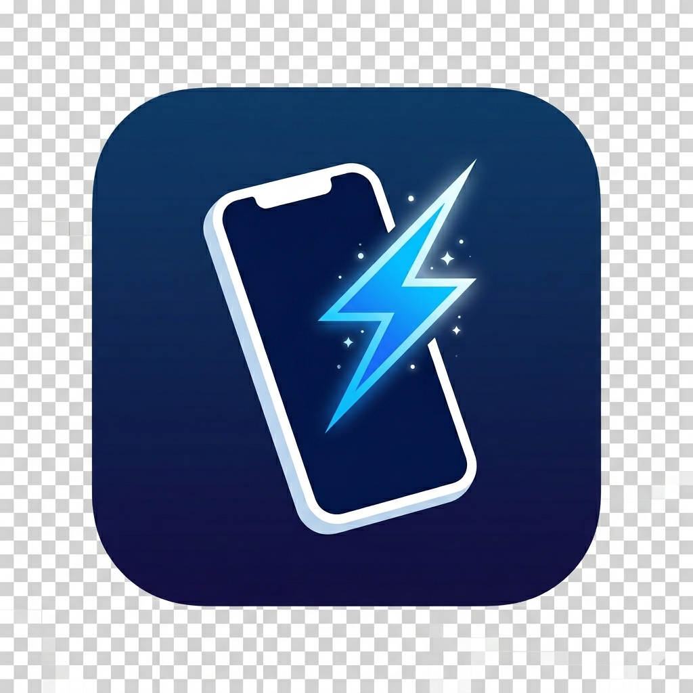
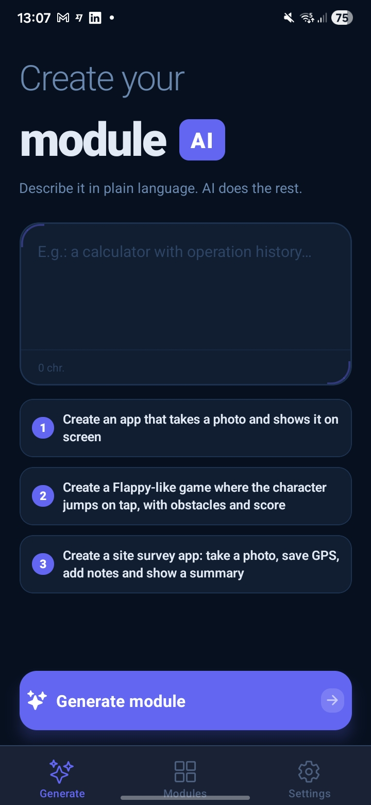
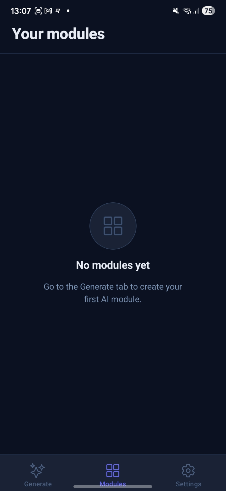
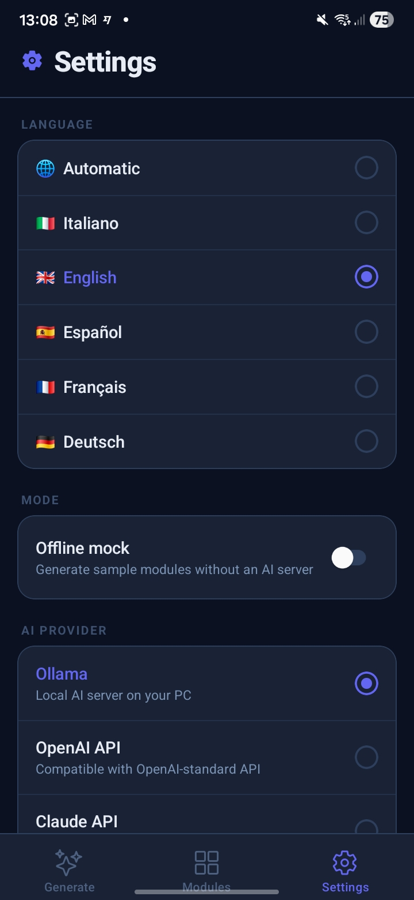
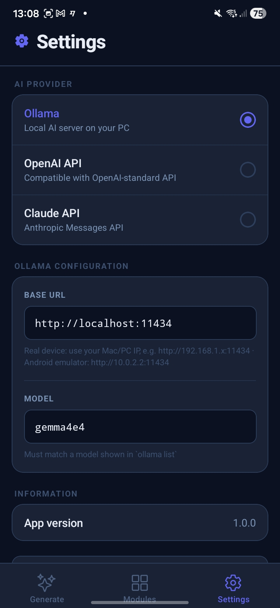

<div align="center">



# AppFromAI

### *Describe it. Build it. Run it. Instantly.*

**The AI-powered mobile app factory that lives inside your phone.**  
Type a sentence in plain language. Get a fully functional, native mobile app.  
No code. No cloud. No waiting.

<br/>

[](https://reactnative.dev)
[](https://expo.dev)
[](https://www.typescriptlang.org)
[](https://zod.dev)
[](./LICENSE)
[](https://www.android.com)
[](https://www.apple.com/ios)

</div>

---

## What is AppFromAI?

**AppFromAI** is a **meta-app**: a single mobile application that generates, validates, and runs other apps on demand — all from a natural language description, entirely on your device.

You don't browse templates. You don't configure a drag-and-drop builder. You don't wait for a cloud server to render something.

You just *describe what you want*, and AppFromAI builds it — right there, right now, running natively on your phone.

```
"Create a field inspection app: take a photo, save GPS coordinates,
 add notes, and show a summary I can share."
                              ↓
              AI generates JSON UI + JavaScript logic
                              ↓
     AppFromAI validates, compiles, and runs it in a secure sandbox
                              ↓
         A real, interactive, hardware-connected app.
               On your phone. In under 30 seconds.
```

Every generated app — called a **module** — is a first-class citizen. It has its own screen, its own persistent state, its own access to native device hardware, and it can even call other modules like functions.

---

## Why AppFromAI is different

Most "AI app builders" generate a React component that looks like an app, but lives in a browser tab on a server you don't control.

AppFromAI is fundamentally different:

| Capability | AppFromAI | Typical AI builders |
|---|:---:|:---:|
| 100% on-device execution | ✅ | ❌ |
| Real native UI (not WebView) | ✅ | ❌ |
| Access to camera, GPS, microphone, sensors | ✅ | ❌ |
| Works with a local LLM (Ollama) | ✅ | ❌ |
| No new APK / IPA to install per app | ✅ | ❌ |
| Modules compose and call each other | ✅ | ❌ |
| Generated modules run 100% offline | ✅ | ❌ |
| Open source | ✅ | ❌ |
| Multi-language UI (🇮🇹 🇬🇧 🇪🇸 🇫🇷 🇩🇪) | ✅ | ❌ |

---

## Screenshots

<div align="center">

| Generate | Modules |
|:---:|:---:|
|  |  |
| *Describe your app in plain language — AI does the rest* | *Your generated modules, always one tap away* |

| Settings — Language | Settings — AI Provider |
|:---:|:---:|
|  |  |
| *Switch between 5 languages instantly* | *Ollama, OpenAI, or Claude — your choice* |

</div>

---

## Demo

<div align="center">

<video src="https://github.com/user-attachments/assets/8cee08c2-1186-434f-913f-71df0def0099" controls width="600"></video>

> *From a single sentence to a fully working native app — in under 30 seconds.*

</div>

---

## What you can build — in one sentence

AppFromAI can generate an enormous range of apps on the fly. Here are just a few examples of what you can type:

- *"A voice memo app that records, saves, and plays back audio"*
- *"A Flappy Bird-style game with on-screen gamepad controls"*
- *"A QR code scanner that saves every scan to a history list"*
- *"A calorie tracker with a searchable food log and daily total"*
- *"A field inspection tool: photo + GPS + notes + shareable report"*
- *"A flashlight with an SOS Morse code mode"*
- *"A habit tracker with streaks and push notification reminders"*
- *"A bouncing ball physics sandbox I can tap to control"*

If it fits on a mobile screen and uses hardware you have, AppFromAI can build it.

---

## The module system

Every generated app is a **module** — a single, self-contained JSON object with three parts:

```json
{
  "manifest": {
    "id": "voice-notes",
    "name": "Voice Notes",
    "version": "1.0.0",
    "runtime": "javascript",
    "permissions": ["audioRecorder", "storage"]
  },
  "ui": {
    "type": "navigator",
    "initialScreen": "home",
    "screens": {
      "home": {
        "type": "screen",
        "title": "Voice Notes",
        "onFocus": "loadNotes",
        "components": [
          { "type": "list", "bind": "notes", "emptyText": "No recordings yet" },
          { "type": "button", "id": "rec", "text": "Record", "action": "startRecording" }
        ]
      },
      "record": {
        "type": "screen",
        "title": "Recording",
        "components": [
          { "type": "text", "bind": "status", "text": "Ready" },
          { "type": "button", "id": "stop", "text": "Stop & Save", "action": "stopRecording" }
        ]
      }
    }
  },
  "code": "module.exports = { actions: { async loadNotes(api, input, state) { ... }, async startRecording(api, input, state) { ... }, async stopRecording(api, input, state) { ... } } };"
}
```

**The manifest** declares identity and permissions.  
**The UI** is a declarative tree of native components — screens, inputs, buttons, lists, images, even a full game canvas with a physics ticker.  
**The code** is JavaScript that runs in a secure sandbox, calling a rich, permission-gated API.

The AI generates all three at once. AppFromAI validates and compiles them before anything runs.

---

## Native capabilities — the full API

Every module has access to a rich set of native capabilities, each gated behind explicit user consent:

| Capability | API |
|---|---|
| 📷 Camera & photos | `api.camera.takePhoto()` |
| 🎙️ Audio recording | `api.audioRecorder.start()` / `.stop()` |
| 🔊 Audio playback | `api.audioPlayer.play(uri)` |
| 📍 GPS & location | `api.location.getCurrentPosition()` |
| 🧭 Motion & sensors | `api.sensors.getAccelerometer()` |
| 💾 File storage | `api.files.save(key, uri)` |
| 🗄️ Key-value storage | `api.storage.save / load / list / delete` |
| 🔔 Push notifications | `api.notifications.schedule(title, body, delay)` |
| 🗣️ Text-to-speech | `api.tts.speak(text, { language: 'en-US' })` |
| 📳 Haptic feedback | `api.haptics.impact('medium')` |
| 📋 Clipboard | `api.clipboard.set(text)` / `.get()` |
| 🔗 Share sheet | `api.share.text(str)` / `.file(uri)` |
| 📷 QR / barcode scanner | `api.qrScanner.scan()` |
| 🔦 Torch / flashlight | `api.torch.setEnabled(true)` |
| 🌐 HTTP network fetch | `api.network.fetch(url, options)` |
| 📞 Phone / SMS / email | `api.linking.dialPhone / sendSms / composeEmail` |
| 🤖 Cross-module calls | `api.modules.run(id, action, input)` |

---

## The game engine — yes, you can build games

AppFromAI ships with a built-in **game canvas** component (`gameView`) and an **on-screen gamepad** (`gamepad`), giving the AI everything it needs to generate fully playable 2D games.

The game engine is declarative: the AI describes the scene as an array of objects (rectangles, circles, text labels), and AppFromAI renders them at up to 60fps. Physics, input, collision, scoring — all in JavaScript, all generated on the fly.

```
"Create a Flappy Bird clone with on-screen arrow controls,
 pipes that speed up over time, and a high-score counter."
```

AppFromAI generates the game loop, the renderer, the gamepad layout, the score state, and the collision logic — all in one shot.

**Recent game engine additions:**
- Per-object physics (`vx`, `vy`, `gravity`) applied automatically every tick — no manual physics code needed
- `fps` property on `gameView` to set frame rate declaratively (10–60 fps)
- `onCollideAction` — fired automatically on AABB overlap between any two identified objects
- `onOutOfBoundsAction` — fired when an object leaves the canvas bounds
- Global `gravity` on the `gameView` node, applied to all objects at once

**Gamepad layouts:**
- `row` — horizontal button row (left / right / jump)
- `dpad` — cross layout (↑ ← → ↓) for 4-directional movement
- `split` — two-thumb layout (left half / right half of screen)

Buttons support **hold mode**: the action fires repeatedly while the button is pressed, at a configurable rate — perfect for smooth character movement.

---

## Multi-screen navigation

AppFromAI modules support full **multi-screen navigation** via a declarative `navigator` root, with automatic back-button management.

```
Home screen (list of items)
    │
    └──▶ Detail screen (edit / view)
              │
              └──▶ (save and go back → list auto-refreshes)
```

The `onFocus` hook ensures that any screen that shows data from storage **automatically reloads** every time it becomes active — whether it's the first visit or a return from a child screen. No boilerplate, no manual refresh triggers.

---

## Module-to-module communication

The most powerful feature: **modules can call each other like functions** at runtime.

```js
// Inside any module's action
const result = await api.modules.run("tax-calculator", "compute", { amount: 500 });
// → { total: 610, vatAmount: 110 }
```

This enables runtime composition:  
**snap a photo → run it through an OCR module → save the result → send a notification**  
Each step is an independent module, composable without integration code.

---

## Security — every layer, explicitly hardened

AppFromAI runs AI-generated code on your device. That requires a serious, layered security model.

**Before a module is saved:**
- `eval`, `Function`, `new Function`, `require`, `import`, `process`, `global`, `__dirname` — all statically blocked
- The entire module is Zod-validated against a strict schema
- Every declared UI action must exist in the compiled code

**Before a module runs:**
- A native permission consent screen shows the user exactly what hardware/data the module wants
- Only permissions declared in the manifest and granted by the user are active

**While a module runs:**
- The sandbox API is the only interface to native capabilities — no direct OS access
- Actions are killed after 8 seconds
- Return values must be JSON-serializable
- Cross-module call depth is capped at 3 levels

**In the UI:**
- The renderer validates every node type before rendering
- Unknown or malformed nodes are silently dropped — the app never crashes on bad AI output

---

## AI provider flexibility

AppFromAI works with any LLM that can produce structured JSON — with built-in retry logic and error recovery:

| Provider | How |
|---|---|
| **Ollama** (local) | Any model via `/api/chat` — runs on your own hardware, fully private |
| **OpenAI** | Any OpenAI-compatible API endpoint |
| **Claude** | Anthropic Messages API |
| **Mock mode** | Instant, offline demo modules for testing — no AI needed |

The generation pipeline includes automatic retry with targeted hints on failure: if the JSON is truncated, if an action is missing, if the code has a runtime error — AppFromAI tells the model exactly what went wrong and asks it to regenerate intelligently.

---

## Multi-language UI

AppFromAI ships with a full internationalization system. The entire interface — tabs, buttons, alerts, permission screens, error messages — is available in:

🇮🇹 Italiano · 🇬🇧 English · 🇪🇸 Español · 🇫🇷 Français · 🇩🇪 Deutsch

Language is auto-detected from the device locale, and can be overridden at any time in Settings.

---

## Tech stack

| Layer | Technology |
|---|---|
| UI framework | React Native 0.81 + Expo SDK 54 |
| Navigation | Expo Router v6 (file-based) |
| JS engine | Hermes — lightweight, fast, sandboxed |
| Schema validation | Zod v4 — strict, typed, zero-tolerance |
| Persistent storage | AsyncStorage + expo-file-system |
| Audio | expo-av |
| Camera / QR | expo-camera |
| Location | expo-location |
| Sensors | expo-sensors |
| Notifications | expo-notifications |
| Haptics / TTS | expo-haptics + expo-speech |
| Language | TypeScript 5.9, strict mode |

---

## Getting started

```bash
git clone https://github.com/your-username/AppFromAI
cd AppFromAI
npm install
npx expo start
```

Scan the QR code with **Expo Go**, or run a full dev build:

```bash
npx expo run:android  # Android — tested ✅
npx expo run:ios      # iOS — not yet tested ⚠️
```

> **Platform status:**
> - ✅ **Android** — tested and working
> - ⚠️ **iOS** — code is compatible but not yet tested on a real device or simulator. Contributions welcome.

### Use a local LLM (recommended — fully private)

1. Install [Ollama](https://ollama.com) on your Mac or PC and pull a model:
   ```bash
   ollama pull gemma3:4b
   # or: ollama pull mistral, llama3.2, etc.
   ```
2. Open AppFromAI → **Settings** → select **Ollama**
3. Set the URL to your machine's local IP:
   - Real device: `http://192.168.1.x:11434`
   - Android emulator: `http://10.0.2.2:11434`
4. Set the model name to match `ollama list`

### Use OpenAI or Claude

Set your provider in Settings and enter your API key and endpoint. Any OpenAI-compatible API works.

---

## Project structure

```
app/
  (tabs)/
    index.tsx        Generate screen — the main prompt interface
    modules.tsx      Module library — browse, open, delete
    settings.tsx     AI provider, language, mock mode
  module/[id].tsx    Module runner — permission gate + live renderer
  _layout.tsx        Root layout, providers

src/
  ai/
    aiClient.ts      LLM request pipeline (Ollama / OpenAI / Claude)
    modulePrompt.ts  System prompt engineering — the full generation contract
    mockModules.ts   Offline demo modules
    normalizeGeneratedModule.ts  Pre-Zod normalization & type coercion

  capabilities/
    motherApi.ts     The full sandboxed API exposed to module code
    capabilityRegistry.ts  Lifecycle management for active sensors/streams

  modules/
    moduleStore.ts   AsyncStorage persistence for saved modules
    moduleValidator.ts  Zod + static scan + action cross-validation
    moduleRunner.ts  new Function compilation + action execution

  renderer/
    DynamicRenderer.tsx   State machine, navigator, action runner
    components.tsx        JSON UI tree → React Native components
    ModulePermissionGate.tsx  Native consent UI before hardware access

  security/
    codeScanner.ts   Static pattern blacklist (eval, Function, etc.)
    runtimePermissions.ts  Native OS permission prefetch

  i18n/
    translations.ts  All UI strings in 5 languages
    useI18n.ts       Language hook with auto-detect

  settings/
    settingsStore.ts   AsyncStorage persistence for app settings
    SettingsContext.tsx  React context for settings

  types/
    uiNodes.ts       TypeScript types for the full UI node tree
    generatedModule.ts  Zod schemas for the complete module format
```

---

## Roadmap

### 🧩 New UI components
- [x] **WebView** — embed any website or web content inline inside a generated module; the AI can generate a `webview` node that opens in an in-app browser with a single tap
- [ ] **Charts** — bar, line, and pie chart components in the declarative UI tree; generated modules can visualize data without a single line of chart code
- [ ] **Map view** — display GPS coordinates and routes on an interactive map, directly inside any generated module
- [ ] **Rich list items** — list rows with avatar, subtitle, badge, and swipe-to-delete, so the AI can generate beautiful data-driven apps instead of plain text lists

### ⚡ Platform power
- [ ] **Background scheduler** — trigger any module action on a cron schedule while the app is closed; habit reminders, data sync, periodic sensor readings
- [ ] **SQLite storage** — a real relational database available to modules that need joins, queries, and structured data beyond key-value pairs
- [ ] **Biometric lock** — protect individual modules with Face ID or fingerprint; one setting, zero code

### 🤝 Sharing & community
- [x] **Module rename** — tap the module name to rename it directly from the library screen, without regenerating
- [ ] **Module export & import** — export any module as a single JSON file and share it via AirDrop, link, or QR code; anyone with AppFromAI can import and run it instantly
- [ ] **Module marketplace** — a curated feed of community-built modules; browse, preview, and install in one tap

### 🛠️ Developer experience
- [ ] **Live module editor** — edit a module's UI or code directly inside the app and hot-reload it without regenerating from scratch
- [ ] **Smart auto-fix** — when a module throws a runtime error, automatically send the stack trace to the LLM and apply the patch; one tap from error to working app

---

## Contributing

All contributions are welcome — bug fixes, new capabilities, new UI components, module examples, translations, and documentation.

If you build something great with AppFromAI, open a PR to add it to the `examples/` folder. Every cool example makes the tool more powerful for everyone.

---

## License

MIT — use it, fork it, ship it, build on it.

---

## Vision

I believe we're moving toward a future where phones don't come with apps — they generate them.

When you need something, your device builds it for you, tailored to exactly what you asked, runs it, and discards it when you're done. No App Store. No installations. No one-size-fits-all software designed for the average of everyone and perfect for no one.

AppFromAI is an early, open-source experiment in that direction. It's rough around the edges — but the core idea works. Type a sentence. Get a real app. Today, on your phone.

That's where we're going.

---

## Disclaimer

AppFromAI is an independent open-source project and is **not affiliated with, endorsed by, or officially connected to** OpenAI, Anthropic, or Ollama in any way.

"OpenAI" and "ChatGPT" are trademarks of OpenAI, LLC. "Claude" is a trademark of Anthropic, PBC. "Ollama" is a trademark of Ollama, Inc. All third-party trademarks are the property of their respective owners and are referenced here solely to describe software compatibility.

Users are responsible for complying with the terms of service of any AI provider they connect to AppFromAI.

---

<div align="center">

**AppFromAI** — *Every app you ever needed. One sentence away.*

</div>
